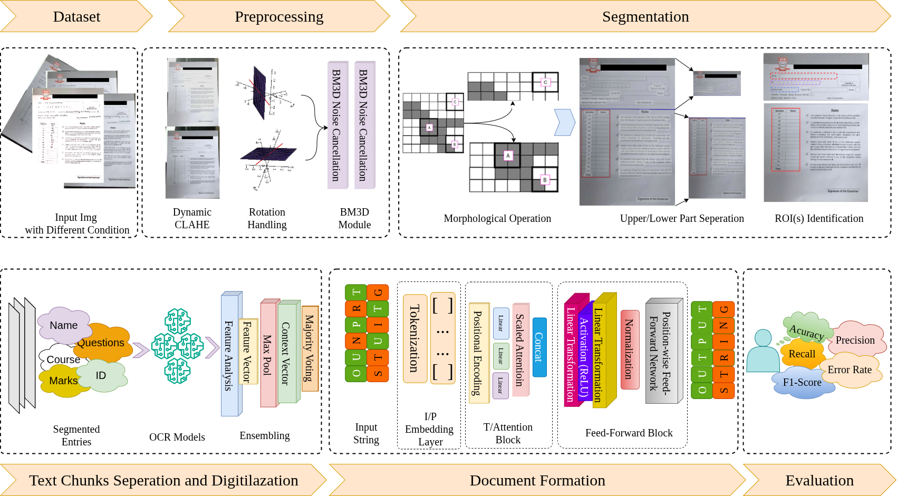

# uFOIL: An Unsupervised Fusion of Image Processing and Language Understanding

This repository contains the source code for **uFOIL**, an unsupervised ensemble-based framework for automating the extraction and validation of key information from exam script images, without requiring annotated training data. The framework combines a dynamically adaptive preprocessing pipeline, unsupervised image segmentation, a four-model OCR ensemble fused through majority voting, and confidence-scored post-processing validation.

Methodology overview:


[](https://doi.org/10.1109/ACCESS.2025.3542417)

## Directories

```
.
configs
└── default.yaml
data
└── README.md
imgs
└── diagram.png
README.md
requirements.txt
src
├── format
│   └── transformer_formatter.py
├── ocr_ensmbl
│   ├── blstm.py
│   ├── dl_weights.py
│   ├── majority_voting.py
│   └── models
│       ├── craft.py
│       ├── easyocr_model.py
│       ├── tesseract.py
│       └── trocr_model.py
├── pipeline.py
├── postproc
│   ├── confidence_scoring.py
│   └── field_validation.py
├── preproc
│   ├── augmentation_gan.py
│   ├── clahe.py
│   ├── denoising_bm3d.py
│   └── rotation.py
└── segmnt
    ├── background_isolation.py
    ├── label_field_detection.py
    ├── section_separation.py
    └── table_segmentation.py
```

## Dataset

Consists of 412 (augmented to 712 samples using a GAN) custom-created exam script samples based on a standardized template from United International University, Bangladesh. Due to student and institutional privacy, the dataset is not publicly released. Raw images follow the naming convention:
 
```
IMG_<STUDENT_NAME>_<ID>_<MARKS>.jpg/png
```
 
- `STUDENT_NAME` - can contain multiple words (spaces become underscores)
- `ID` - student ID
- `MARKS` - total mark for that script, used both as GT for
  name/ID extraction accuracy and to validate the OCR-extracted
  question marks sum


## BibTeX

```bibtex
@article{rahman2025ufoil,
    title={uFOIL: An Unsupervised Fusion of Image Processing and Language Understanding},
    author={Rahman, Md Abdur and Hasan, Md Tanzimul and Howlader, Umar Farooq and Kader, Md Abdul and Islam, Md Motaharul and Pham, Phuoc Hung and Hassan, Mohammad Mehedi},
    journal={IEEE Access},
    volume={13},
    pages={31683--31700},
    year={2025},
    publisher={IEEE}
}
```

> [!NOTE]
> The repository is now archived. We are currently working on developing unsupervised vision-language models for the remaining labels. We will share the code once done. Thanks!